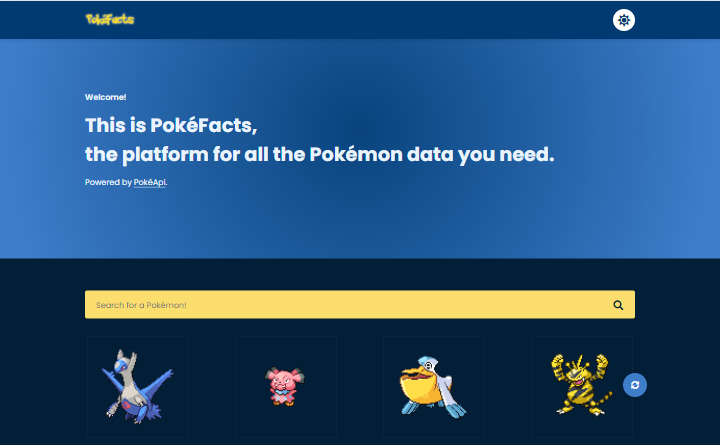
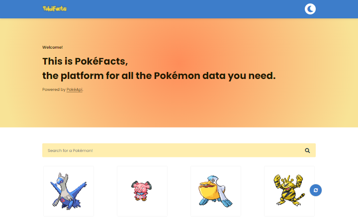

# PokéFacts

PokéFacts é uma plataforma que consome os dados da API [PokéApi](https://pokeapi.co/about) para disponibilizar informações(como habilidades, ataques, localizações, entre outras) de mais de 1118 Pokémons.

Este projeto é um redesign. A primeira e antiga pode ser acessada [nesse link](https://oliverids.github.io/pokefacts/).

 <a href="#desafio">O desafio</a> | 
 <a href="#tecnologias">Tecnologias</a> | 
 <a href="#interface">Interface</a> | 
 <a href="#links">Links</a> |
 <a href="#redes">Redes</a>

### Visão Geral

#### O desafio

O usuário pode:

- Ver o layout do aplicativo independente do tamanho da tela (Design Responsivo);
- Procurar qualquer Pokémon dentre os disponíveis da API;
- Ler informações sobre o Pokémon pesquisado;
- Também pode procurar por um Pokémon aleatório através de uma lista randômica;
- Escolher entre os temas escuro e claro.

#### Tecnologias

- HTML5 semântico
- Propriedades CSS customizadas
- Flexbox
- JavaScript Síncrono e Assíncrono
- SASS Compiler
- Mobile-first Workflow

#### Interface

#### Links

- Live Site URL: [Github Pages](https://oliverids.github.io/pokemon-facts/)

 

#### Redes

FrontEnd Mentor: <a href="https://www.frontendmentor.io/profile/oliverids">@oliverids</a>

